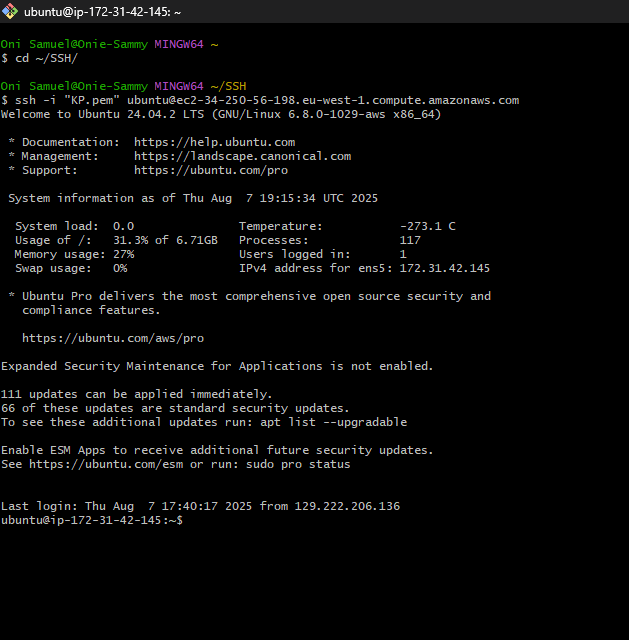
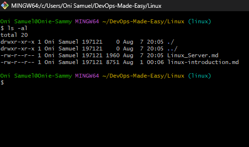
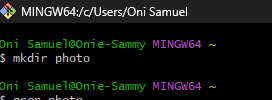
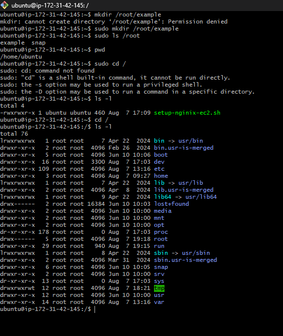
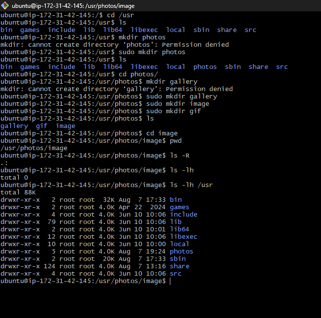
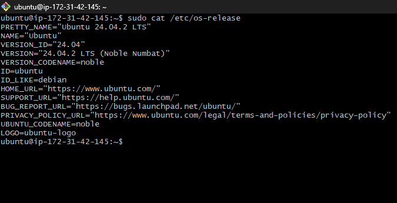

# 🐧 Essential Linux Commands

A quick reference for frequently used Linux terminal commands with common flags and examples.

---



## 📁 1. `ls` – List Directory Contents



### Syntax:
```bash
ls [options] [directory]
```

### Common Flags:
| Flag | Description                  |
|------|------------------------------|
| `-l` | Long listing format          |
| `-a` | Show all files (including hidden) |
| `-h` | Human-readable file sizes    |
| `-R` | Recursively list directories |

### Examples:
```bash
ls                # List files in current directory
ls -l             # Long format listing
ls -la            # Show all files in long format
ls -lh /var/log   # Human-readable sizes in /var/log
```

---

## 📂 2. `mkdir` – Make Directories



### Syntax:
```bash
mkdir [options] directory_name
```

### Common Flags:
| Flag | Description                        |
|------|------------------------------------|
| `-p` | Create parent directories as needed |

### Examples:
```bash
mkdir project               # Create a directory
mkdir -p logs/nginx/error   # Create nested directories
```

---

## 📍 3. `pwd` – Print Working Directory

### Syntax:
```bash
pwd
```


### Description:
Displays the full path of the current working directory.

### Example:
```bash
pwd
# Output: /home/ubuntu/myproject
```

---

## 🔐 4. `sudo` – Superuser Do

### Syntax:
```bash
sudo command
```


### Description:
Executes a command with superuser (root) privileges.

### Examples:
```bash
sudo apt update
sudo systemctl restart nginx
```

---

## 📂 5. `cd` – Change Directory

### Syntax:
```bash
cd [directory]
```


### Examples:
```bash
cd /var/log        # Go to /var/log
cd ..              # Move up one directory
cd ~               # Go to home directory
cd -               # Go to previous directory
```

---

## 📄 6. `cp` – Copy Files and Directories

### Syntax:
```bash
cp [options] source destination
```

### Common Flags:
| Flag | Description                        |
|------|------------------------------------|
| `-r` | Copy directories recursively       |
| `-v` | Verbose output                     |
| `-u` | Copy only if source is newer       |

### Examples:
```bash
cp file.txt /tmp/                 # Copy file to /tmp
cp -r project/ backup/            # Copy entire directory
cp -vu file.txt backup/           # Verbose and update mode
```

---

## 🚚 7. `mv` – Move or Rename Files

### Syntax:
```bash
mv [options] source destination
```

### Examples:
```bash
mv old.txt new.txt            # Rename file
mv file.txt /home/user/docs/  # Move file to directory
```

---

## ❌ 8. `rm` – Remove Files or Directories

### Syntax:
```bash
rm [options] file_or_directory
```

### Common Flags:
| Flag | Description                        |
|------|------------------------------------|
| `-r` | Recursive delete                   |
| `-f` | Force delete without prompt        |
| `-v` | Verbose output                     |

⚠️ Use with caution — especially with `-rf`

### Examples:
```bash
rm file.txt                 # Delete a file
rm -r folder/               # Delete a folder recursively
rm -rf /tmp/test/           # Forcefully delete directory
```

---

## 🔎 9. `find` – Search for Files

### Syntax:
```bash
find [path] [options]
```

### Common Flags:
| Flag | Description                        |
|------|------------------------------------|
| `-name` | Search by name                  |
| `-type` | Specify type (f = file, d = dir)|
| `-size` | Search by size (e.g., +1M, -10k)|
| `-exec` | Run command on matched files    |

### Examples:
```bash
find . -name "*.log"               # Find all .log files
find /var -type d -name "nginx"   # Find nginx directories
find . -size +10M                 # Files larger than 10MB
find . -name "*.tmp" -exec rm {} \;  # Delete all .tmp files
```

---

## 📌 Tip:
Use `man` for manual pages:
```bash
man ls
man find
```
---
## cat 
```bash 
cat filename.txt
```

---


## 🧰 Summary Table

| Command | Purpose                          |
|---------|----------------------------------|
| `ls`    | List files and directories       |
| `mkdir` | Create new directories           |
| `pwd`   | Show current working directory   |
| `sudo`  | Run command as superuser         |
| `cd`    | Change current directory         |
| `cp`    | Copy files and directories       |
| `mv`    | Move or rename files             |
| `rm`    | Remove files or directories      |
| `find`  | Search for files/directories     |
| `cat`   | Concatenate the output           |
