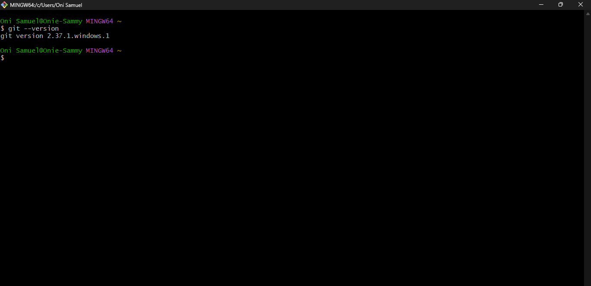
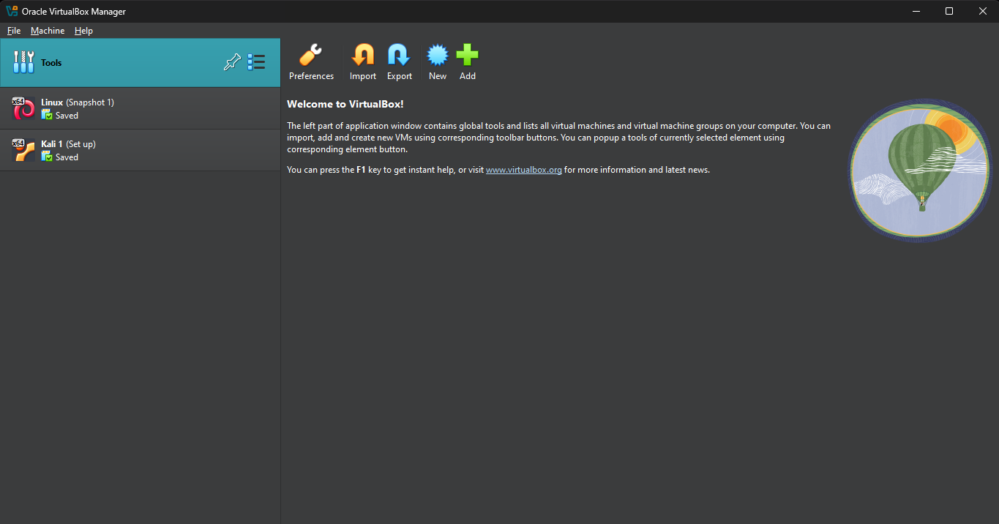
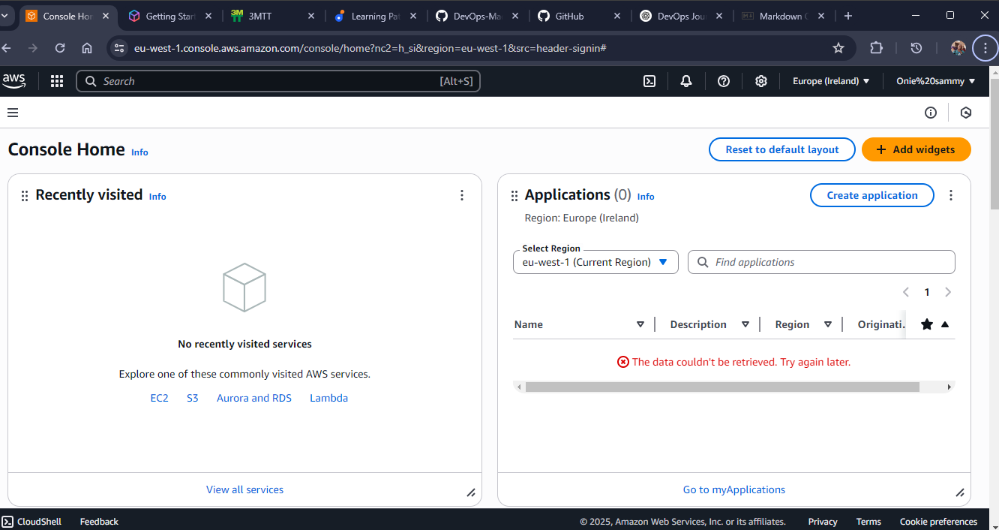

## 🚀 Prerequisite Tools

Before diving into the DevOps journey, make sure the following tools are installed on your machine:

### 1. 🧰 Git
Version control system for tracking changes and collaborating on code.

- 🔗 [Download Git](https://git-scm.com/downloads)
  

### 2. 🖥️ Visual Studio Code (VS Code)
Lightweight and powerful code editor with DevOps-friendly extensions.

- 🔗 [Download VS Code](https://code.visualstudio.com/)

- 

### 3. 📦 VirtualBox + Ubuntu Image
For running virtual environments and simulating Linux-based DevOps tools.

- 🔗 [Download VirtualBox](https://www.virtualbox.org/wiki/Downloads)  
- 🔗 [Download Ubuntu ISO](https://ubuntu.com/download/desktop)

> ✅ Tip: You can also use WSL (Windows Subsystem for Linux) as an alternative to VirtualBox on Windows.

### 4. 🐙 GitHub Account  
You’ll need a GitHub account for version control, collaboration, and storing your code in repositories.

  

🔗 [Create a GitHub Account](https://github.com/signup)

---

### 5. ☁️ AWS Account  
Cloud computing platform we'll use for deploying infrastructure and services in real-world DevOps projects.

🔗 [Create an AWS Account](https://portal.aws.amazon.com/billing/signup)

  
> 🔒 Make sure to enable 2FA and set up billing alerts to avoid unwanted charges.

---

Once these tools and accounts are ready, you’re all set to start your hands-on DevOps journey! 