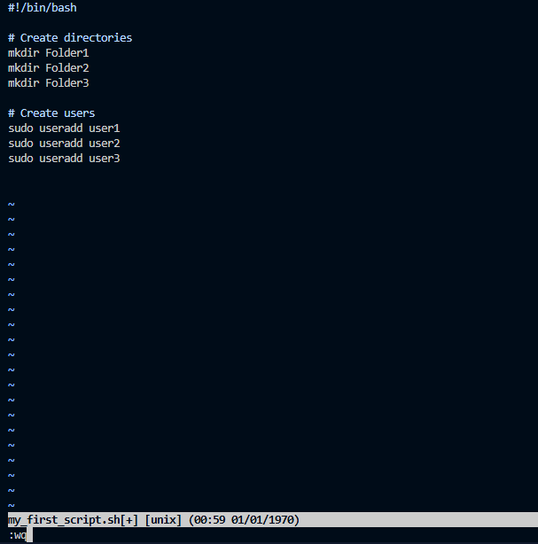
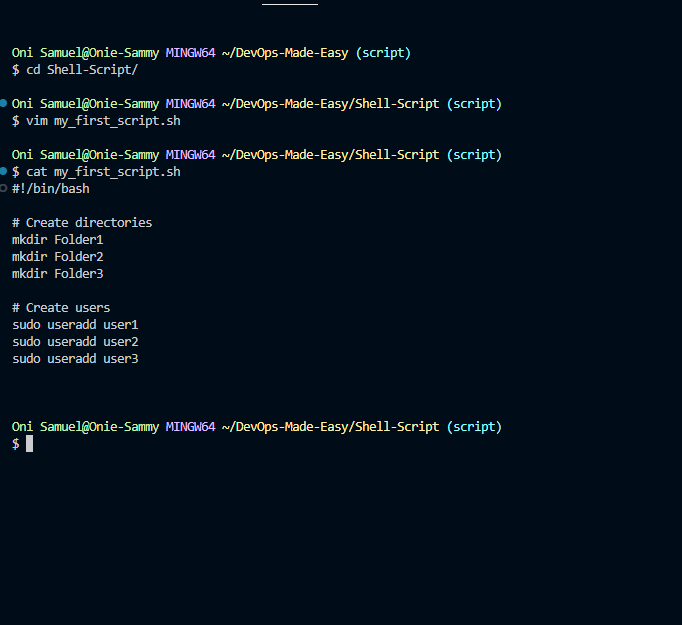
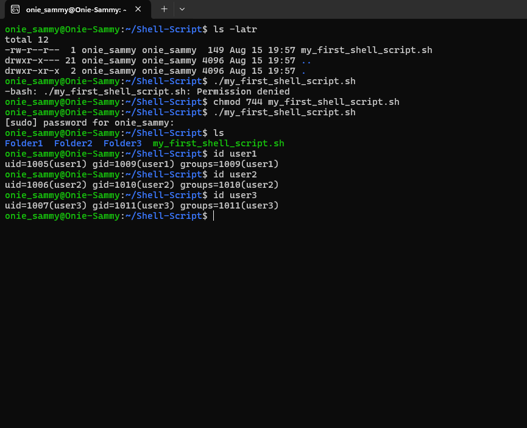

# 🐚 Introduction to Shell Scripting

Shell scripts are text files containing a series of commands for the Unix/Linux shell to execute. They automate repetitive tasks, simplify system administration, and can combine multiple commands into a single executable file.

---

## 📄 Basic Structure

A shell script usually starts with a shebang (`#!`) line to specify the interpreter:

```bash
#!/bin/bash
# This is a comment
echo "Hello, World!"
```

- `#!/bin/bash` tells the system to use the Bash shell.
- Lines starting with `#` are comments.

---

##  How to Run a Shell Script

1. **Create the script file:**
   ```bash
   nano myscript.sh
   ```
2. **Make it executable:**
   ```bash
   chmod +x myscript.sh
   ```
3. **Run the script:**
   ```bash
   ./myscript.sh
   ```

---

## Tasks

```bash
mkdir Shell-Scripting
vim my_first_shell_script.sh
cd shell-scripting
cat my_first_shell_script.sh
```





```bash 
ls -latr
./my_first_shell_script.sh
chmod 744 my_first_shell_script.sh
./my_first_shell_script.sh
ls
id user1
id user2
id user3
```


---

